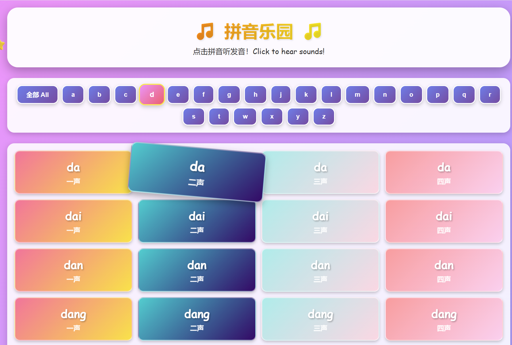

# 🌈 拼音乐园 - Pinyin Kids Learning App

A colorful and interactive Pinyin learning web app designed for young children (5 years old) to learn Chinese pronunciation.



## ✨ Features

- 🎨 **Colorful & Attractive**: Rainbow gradients, animations, and child-friendly design
- 🎵 **1,600+ Audio Files**: All MP3 resources included locally
- 🔊 **Interactive Learning**: Click any pinyin card to hear the pronunciation
- 🔍 **Easy Filtering**: Filter by initial consonant (a-z) or view all
- 📱 **Responsive Design**: Works on desktop, tablet, and mobile devices
- 🎯 **Simple & Fun**: No complicated menus, just click and learn!
- 📦 **Self-Contained**: No external dependencies - all resources included

## 🚀 Quick Start

### Prerequisites

- Node.js (v12 or higher)

### Installation

1. Install dependencies:
```bash
npm install
```

2. Start the server:
```bash
npm start
```

3. Open your browser and visit:
```
http://localhost:3000
```

### Custom Port

To run on a different port:
```bash
PORT=8080 npm start
```

## 📁 Project Structure

```
pinyin/
├── server.js           # Express backend server
├── package.json        # Project dependencies
├── public/
│   ├── index.html     # Main HTML page
│   ├── styles.css     # Colorful CSS styles
│   ├── app.js         # Frontend JavaScript
│   └── sounds/        # 1,600+ pinyin MP3 files
│       ├── a1/
│       ├── a2/
│       ├── ba1/
│       └── ... (all pinyin combinations)
└── README.md          # This file
```

## 🎮 How to Use

1. **Browse All**: By default, all pinyin syllables are displayed in groups of 4
2. **Filter**: Click letter buttons (a, b, c...) to see only those syllables
3. **Listen**: Click any colorful card to hear the pronunciation
4. **Learn**: The tone number (一声, 二声, 三声, 四声) is shown on each card

### Fun Features

- Press **'R'** key for a random pronunciation!
- Cards animate when playing sound
- Beautiful rainbow gradient background
- Twinkling stars decoration

## 🎨 Design Features

- **Comic Sans font**: Easy to read for children
- **Rainbow color scheme**: Each card has unique gradient colors
- **Large click targets**: Perfect for small fingers
- **Smooth animations**: Cards grow and rotate on hover
- **Clear feedback**: Visual animation when sound plays

## 🔧 Technical Details

### Backend (Node.js + Express)
- Simple Express server
- Serves static files from `public/` directory
- All MP3 files included locally in `public/sounds/`
- API endpoint `/api/syllables` lists all available pinyin

### Frontend (Vanilla HTML/CSS/JS)
- No frameworks needed - pure JavaScript
- CSS Grid for responsive layout
- Web Audio API for sound playback
- Gradient animations using CSS keyframes

## 🌟 Credits

- MP3 audio resources: [plain-pinyin](https://github.com/digglesby/plain-pinyin) by digglesby

## 📝 License

MIT License - Feel free to use and modify for your children's education!

## 💡 Tips for Parents

- Start with filtering by a single letter (like 'A' or 'B')
- Practice one tone at a time
- Make it a game: "Can you find the '一声' sounds?"
- Use daily: Just 10 minutes of clicking and listening helps!
- Encourage your child to repeat the sounds they hear

## 🐛 Troubleshooting

**Sounds don't play?**
- Check computer volume is on
- Try refreshing the browser
- Check browser console for errors (F12)

**Page doesn't load?**
- Make sure Node.js is installed: `node --version`
- Check if port 3000 is available
- Look at terminal for error messages

## 🎓 Educational Value

This app helps children:
- Learn correct Mandarin pronunciation
- Understand the four tones of Chinese
- Build phonetic awareness
- Develop listening skills
- Have fun while learning!

---

Made with ❤️ for young Chinese learners!
